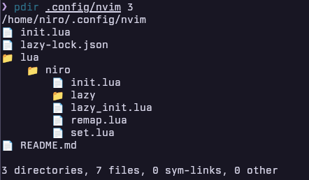

# pdir

pdir ("pretty directory" or "print directory") is a lightweight, Zig-based
implementation of the Linux tree command. It provides a visual representation
of directory structures, using 📁 icons for directories and 📄 icons for files.

> [!Note]
> This is not a 1:1 re-implementation of the `tree` utilities functionalities.

## Features

- Customizable directory path and depth
- Intuitive visual representation of file system structures
- Provides count of directories, files, sym-links, and others
- Simple and efficient command-line interface



## Requirements

Made with [Zig](https://ziglang.org/download/) v0.15.1

> [!CAUTION]
> This was only tested on Linux. Please open issues if you use the Mac version.
> Windows users, you will need to clone the repo and build this yourself.

## Installation

1. Clone the repository:

```sh
git clone https://github.com/nronzel/pdir
cd pdir
```

2. Build the binary:

```sh
zig build -Doptimize=ReleaseSmall
```

OR

[Download the latest release binary](https://github.com/nronzel/pdir/releases/latest)

Be sure to add the binary to a directory that is on your `$PATH`. See [quick setup](#quick-setup)

## Usage

```sh
pdir [directory] [depth]
```

- directory: Optional. Path to the directory you want to visualize. Defaults to
  the current working directory.
- depth: Optional. Maximum depth of directory traversal. Defaults to 2.

With the default depth of 2, it will show the current directory and 1 level of nested directories.

### Examples

```sh
pdir ~/Documents 3
```

This command will display the directory structure of ~/Documents up to a depth
of 3 levels.

```sh
pdir
```

This command will display the directory structure of the current working
directory up to a depth of 2 levels.

## Quick Setup

To use pdir from anywhere in your terminal:

1. Copy the binary to a directory that is in your PATH:

```sh
cp ./zig-out/bin/pdir ~/.local/bin/
```

On Linux, you can view the directories in your path by running:

```sh
echo $PATH
```

Now you can run pdir from any location in your terminal.

## Testing

Run the included tests:

```sh
zig test src/main.zig
```

## About

This was written for educational reasons get more familiar with Zig. It is not a 1:1 of the Linux
`tree` command.
